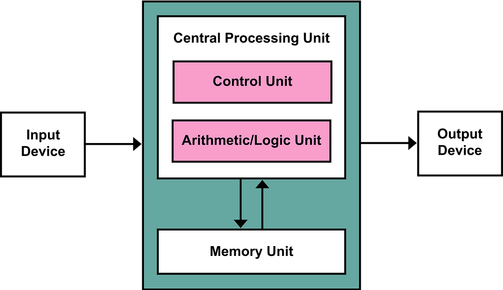
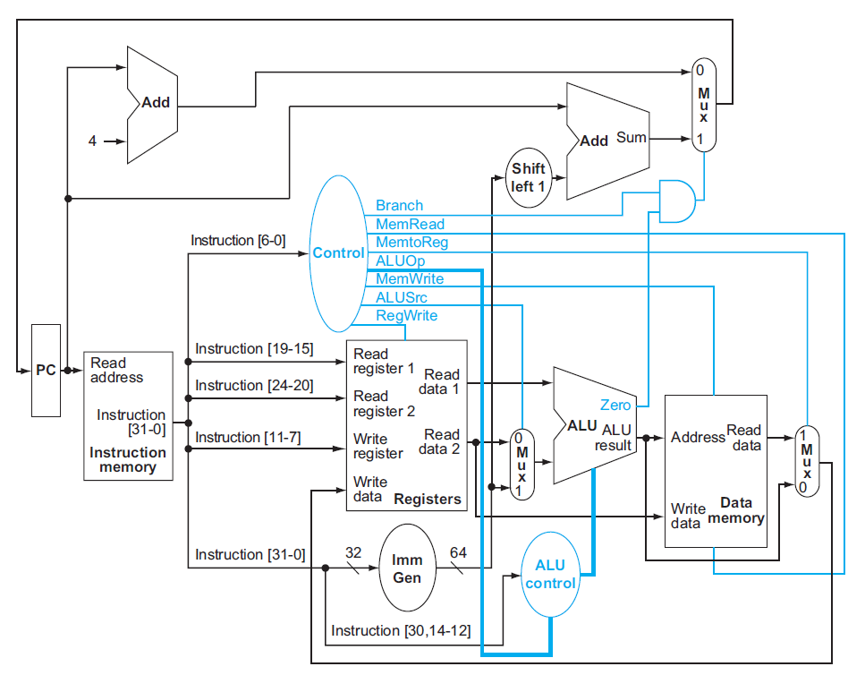
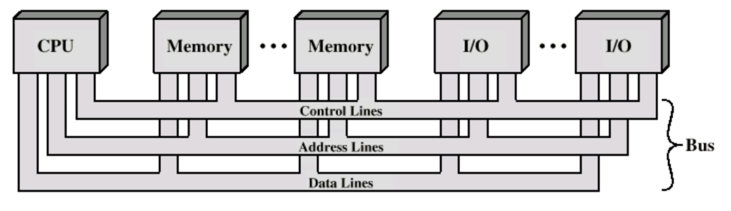

# 1️⃣ 컴퓨터의 구성 🖥

## 컴퓨터의 구성 요소

컴퓨터는 입력 장치, 출력 장치, 기억 장치, 중앙처리장치(CPU), 보조 기억 장치로 구성된다.

1. 입력 장치(Input Device) :
   키보드, 마우스, 스캐너 등
   데이터를 컴퓨터로 전달

2. 출력 장치(Output Device) : 모니터, 프린터, 스피커 등
   처리된 결과를 사용자에게 전달
3. 중앙처리장치(CPU) : 프로그램 실행과 데이터 처리 담당
   ALU(산술 논리 장치) + CU(제어 장치)로 구성
4. 주 기억 장치(Main Memory, RAM) :
   실행 중인 프로그램과 데이터를 저장
   CPU가 직접 접근하여 빠르게 읽고 쓸 수 있음

5. 보조 기억 장치(Storage) : HDD, SSD, USB 등
   데이터를 영구적으로 저장

## 폰 노이만 아키텍처

프로그램도 데이터처럼 메모리에 저장 가능 🏛️

CPU가 메모리에서 프로그램을 읽고 순차적으로 실행 (Fetch-Decode-Execute Cycle) 🔄

명령어와 데이터를 같은 메모리 공간에서 처리

💡 폰 노이만 구조가 특별한 이유
   
   ✔ 하드웨어 변경 없이 소프트웨어만 바꾸면 다른 프로그램 실행 가능 🎉
   
   ✔ 메모리에서 명령어를 불러와 순차적으로 실행하는 개념 도입
   
   ✔ 프로그래밍이 유연해지고, 범용 컴퓨터 개발 가능해짐




## 데이터패스와 CPU 내부 구성
CPU는 크게 두 부분으로 구분

### ✅ 1. 데이터패스(Data Path) 🏗️ 
   ✔ 명령어 실행을 위한 연산 수행

   ✔ ALU, 레지스터, 버스 등 포함

### ✅ 2. 제어 유닛(Control Unit) 🎛️

✔ 데이터가 언제, 어디로 이동할지 결정

- ✔ 데이터패스가 동작하도록 신호를 보냄

### 📌 쉽게 말하면?

- 제어 유닛(CU): "ALU야! 지금 덧셈해!" 🎤

- 데이터패스(ALU & 레지스터): "덧셈 완료!" 🧮



## 버스 시스템 🚌
### 주소 버스 🏠📡
- CPU가 메모리 또는 I/O 장치의 주소를 지정
- 단방향 (CPU → 메모리/I/O)
### 데이터 버스 💾🔄	
- 실제 데이터 전송 (CPU ↔ 메모리/I/O)	
- 양방향 (CPU ↔ 메모리/I/O)
### 제어 버스 🎛️🔀	
- CPU가 읽기/쓰기 여부 및 제어 신호 전달	
- 양방향 (CPU ↔ 메모리/I/O)

### 예시 : 키보드 입력(A) → CPU 처리 → 모니터 출력

| 단계 | 버스 역할 | 버스 사용 예시 |
|------|--------------|--------------------|
| 1️⃣ 키보드 입력 발생 | **제어 버스(Control Bus)** | 키보드 컨트롤러 → CPU로 **인터럽트 요청(IRQ 1) 전송** |
| 2️⃣ CPU가 키보드 데이터 요청 | **주소 버스(Address Bus)** | **키보드 컨트롤러 주소(0x60) 지정** |
| 〃 | **제어 버스(Control Bus)** | **"읽기(Read) 신호" 전송** |
| 3️⃣ 키보드 컨트롤러가 데이터 전송 | **데이터 버스(Data Bus)** | **키코드(0x1E)를 CPU로 전송** |
| 4️⃣ CPU가 화면 출력 준비 | **주소 버스(Address Bus)** | **비디오 메모리(VRAM) 주소(0xB8000) 지정** |
| 〃 | **제어 버스(Control Bus)** | **"쓰기(Write) 신호" 전송** |
| 5️⃣ CPU가 VRAM에 "A" 저장 | **데이터 버스(Data Bus)** | **"A" 데이터(0x41)를 VRAM으로 전송** |
| 6️⃣ 모니터가 VRAM에서 "A"를 읽어 화면 출력 | **모니터 출력** | **"A"가 화면에 표시됨 ✅** |

## 버스 시스템 병목 현상

### 버스 병목현상(Bus Bottleneck)은 CPU, 메모리, I/O 장치 등이 같은 버스를 공유하면서 동시에 사용하려고 할 때, 데이터 전송 속도가 느려지는 문제

### 🎮 예시 : 게임을 할 때, 그래픽 & 사운드 데이터가 한꺼번에 전송될 때 🎮🔊
``` ✅ 상황:

FPS 게임을 실행하면 **GPU(그래픽), 사운드 카드(오디오), 네트워크 카드(온라인 플레이)**가 동시에 동작해야 함.
**그래픽 데이터(고해상도 화면) + 오디오 데이터(게임 사운드) + 네트워크 데이터(멀티플레이 통신)**가 한꺼번에 버스를 사용하면?
데이터 전송 지연 → 게임 프레임 드랍(Lag 발생)

✅ 컴퓨터에서의 동일한 현상:

게임 중 그래픽 카드(GPU)가 화면을 처리하려고 함
동시에 사운드 카드가 배경음악을 재생하려고 함
또 동시에 네트워크 카드가 서버와 데이터를 주고받음
모두 데이터 버스를 공유하기 때문에, 데이터가 몰려서 지연(Lag) 발생

💡 즉, 데이터가 동시에 한 버스로 몰릴 경우, 병목현상이 발생하면서 게임 성능이 저하됨
```

### 병목 현상 해결 방법
1️⃣ 멀티 버스(Multiple Bus) 구조 사용
→ CPU ↔ RAM 전용 버스 + I/O 장치 전용 버스 분리
2️⃣ 하버드 아키텍처(Harvard Architecture) 적용
→ 명령어 버스(Instruction Bus)와 데이터 버스(Data Bus)를 분리하여 속도 증가
3️⃣ DMA(Direct Memory Access) 활용

## 풀링과 인터럽트
둘다 CPU가 I/O 장치와 데이터를 주고받는 방식이다.
### ✅ 폴링 방식의 장점 & 단점
✔ 장점: 구조가 간단하고 구현이 쉬움. 실시간으로 장치 상태를 확인 가능

❌ 단점: CPU가 계속 I/O 장치를 확인해야 해서 불필요한 연산 낭비 발생. CPU가 다른 중요한 작업을 하지 못하고 대기

### ✅ 인터럽트 방식의 장점 & 단점

✔ 장점: CPU가 필요할 때만 반응하여 불필요한 연산 낭비가 없음. CPU가 다른 작업을 수행할 수 있어 효율적
빠른 응답이 가능

❌ 단점: 구현이 복잡함. 여러 개의 인터럽트가 동시에 발생하면 우선순위를 조정하는 로직이 필요함

## DMA란?
CPU의 개입 없이 주변장치와 시스템 메모리 간의 데이터 전송을 가능한 방식이다. DMA는 대량의 데이터를 이동하거나 빠른 입출력을 요구하는 작업에서 유용하며, 입출력 성능을 향상시키고 시스템의 효율성을 높입니다.


