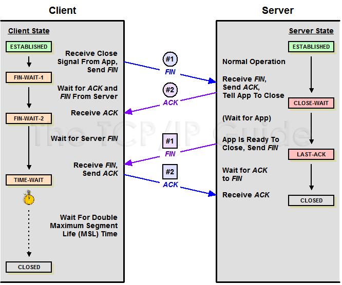

# 📡 TCP 3-Way Handshake

TCP는 데이터를 전송하기 전에 반드시 **신뢰할 수 있는 연결**을 먼저 설정합니다. 이 과정을 **3-Way Handshake**라고 하며, **3번의 메시지 교환**으로 연결이 성립됩니다.

https://youtube.com/shorts/N-j-FZ5c9n0?si=bokNIONf6pPZOa0B

https://youtube.com/shorts/R6WN4_bBB1Q?si=UJ0G0ufK3i38fjs-

---

## ✅ 연결 설정 단계

### 🧩 STEP 1: 클라이언트 → 서버 (SYN)

- 클라이언트가 서버에게 **연결 요청**을 보냅니다.
- 보낸 패킷에는 다음 정보가 담깁니다:
  - `SYN` 플래그 = 1
  - 클라이언트의 **초기 시퀀스 번호(ISN)**

> 📞 예시: 전화 통화에서 "여보세요?"라고 먼저 거는 것과 같습니다.

---

### 🧩 STEP 2: 서버 → 클라이언트 (SYN + ACK)

- 서버는 SYN을 받고 응답합니다:
  - `SYN` 플래그 = 1
  - `ACK` 플래그 = 1
  - 서버의 ISN + 클라이언트의 ISN에 대한 확인 응답

> 📞 예시: 전화 상대가 "여보세요? 누구누구입니다"라고 응답하는 것과 같습니다.

---

### 🧩 STEP 3: 클라이언트 → 서버 (ACK)

- 클라이언트는 서버의 응답(SYN+ACK)을 확인하고 **마지막으로 ACK 응답**을 보냅니다:
  - `ACK` 플래그 = 1
  - 서버 ISN에 대한 응답 번호

> 📞 예시: "네, 연결됐습니다!"라고 마지막 확인 인사를 하는 것과 같습니다.

---

## ⚠️ 예외 상황 & TCP의 대응

### ❗ 예외 1: 클라이언트의 ACK가 유실된 경우

- 서버는 `SYN_RCVD` 상태에서 클라이언트의 ACK를 기다림
- 일정 시간 내에 ACK가 도착하지 않으면 **타임아웃 후 연결 종료**

---

### ❗ 예외 2: 서버의 SYN+ACK가 유실된 경우

- 클라이언트는 응답을 못 받으면 일정 시간 후 **SYN을 재전송**
- TCP는 기본적으로 재전송 횟수와 간격을 설정하여 **재시도**

---

### ❗ 예외 3: 오래된 SYN이 뒤늦게 서버에 도착한 경우

- 클라이언트는 이미 연결 요청을 취소했는데,
- 서버가 응답을 보내면 클라이언트는 이를 **알 수 없음** 상태로 인식
- 클라이언트는 **RST(Reset)** 패킷을 보내 서버에게 "이건 잘못된 연결"이라고 알림

---

## ✅ 정리 요약

| 단계 | 주체 | 내용 | 플래그 |
|------|------|------|--------|
| 1 | 클라이언트 → 서버 | 연결 요청 | SYN |
| 2 | 서버 → 클라이언트 | 요청 수락 + 응답 | SYN + ACK |
| 3 | 클라이언트 → 서버 | 최종 확인 | ACK |

> 💡 모든 단계가 완료되면 양쪽은 `ESTABLISHED` 상태로 진입하며, 데이터 통신을 시작할 수 있습니다.

 ## ✅ 2. TCP 4-Way Handshake - 연결 종료

TCP는 연결을 끊을 때도 **정확하고 순차적인 종료 절차**를 따릅니다.  
바로 이 과정을 **4-Way Handshake**라고 부르며,  
**양방향 통신이므로 각각의 방향을 따로 닫아야 하기 때문에 4단계가 필요**합니다.

---

### 📌 연결 종료 단계

#### 🧩 STEP 1: 클라이언트 → 서버 (FIN)

- 클라이언트가 먼저 "이제 보낼 데이터가 없어요"라고 알림
- `FIN` 플래그가 설정된 패킷을 전송
- 클라이언트는 `FIN_WAIT_1` 상태가 됨

---

#### 🧩 STEP 2: 서버 → 클라이언트 (ACK)

- 서버가 클라이언트의 FIN을 받고 확인 응답
- `ACK` 플래그가 설정된 패킷을 보냄
- 서버는 `CLOSE_WAIT` 상태가 됨 (아직 데이터 전송 가능)
- 클라이언트는 `FIN_WAIT_2` 상태로 전환

---

#### 🧩 STEP 3: 서버 → 클라이언트 (FIN)

- 서버도 "이제 저도 다 보냈어요"라고 종료 요청
- `FIN` 플래그가 설정된 패킷 전송
- 서버는 `LAST_ACK` 상태가 됨

---

#### 🧩 STEP 4: 클라이언트 → 서버 (ACK)

- 클라이언트가 서버의 FIN에 대해 확인 응답
- `ACK` 플래그가 설정된 패킷을 전송
- 클라이언트는 `TIME_WAIT` 상태에 들어가 일정 시간 대기 후 `CLOSED`
- 서버는 ACK를 받고 즉시 `CLOSED` 상태로 전환

---

### ⚠️ 예외 상황 & TCP의 대응

#### ❗ 예외 1: 서버의 FIN이 유실됨

- 서버는 클라이언트로부터 ACK를 못 받음 → FIN을 재전송
- 클라이언트는 여전히 `TIME_WAIT` 상태이므로 FIN을 수신 가능 → 다시 ACK 전송

---

#### ❗ 예외 2: 클라이언트의 마지막 ACK가 유실됨

- 서버는 ACK를 못 받으면 FIN을 재전송
- 클라이언트는 `TIME_WAIT` 상태에서 해당 FIN을 다시 받고 ACK를 재전송함
- **그래서 TIME_WAIT은 꼭 필요한 상태**

---

#### ❗ 예외 3: 클라이언트가 FIN 보내자마자 소켓 종료

- 서버가 FIN을 재전송해도 클라이언트는 응답할 수 없음
- 클라이언트가 소켓을 닫아버렸기 때문에 FIN에 대해 RST로 응답하거나 무시
- 서버는 연결 상태를 정확히 알 수 없어 **자원 낭비, 비정상 상태 발생**

---

### ✅ 정리 요약

| 단계 | 주체 | 내용 | 플래그 | 상태 변화 |
|------|------|------|--------|------------|
| 1 | 클라이언트 → 서버 | 연결 종료 요청 | FIN | `FIN_WAIT_1` |
| 2 | 서버 → 클라이언트 | 종료 수락 | ACK | `CLOSE_WAIT`, `FIN_WAIT_2` |
| 3 | 서버 → 클라이언트 | 서버도 종료 요청 | FIN | `LAST_ACK` |
| 4 | 클라이언트 → 서버 | 최종 확인 | ACK | `TIME_WAIT → CLOSED` (서버는 바로 CLOSED) |

> 💡 **TIME_WAIT 상태는 마지막 ACK 손실 상황에 대비하기 위한 보호 타이머입니다.**

